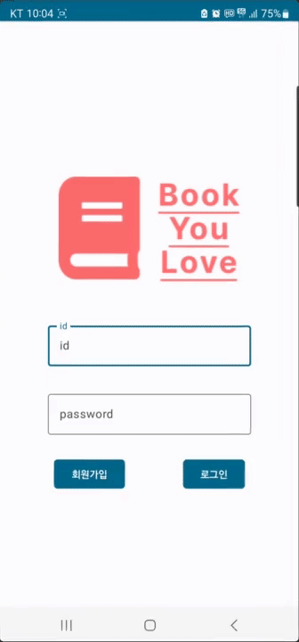
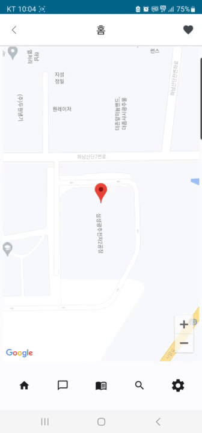
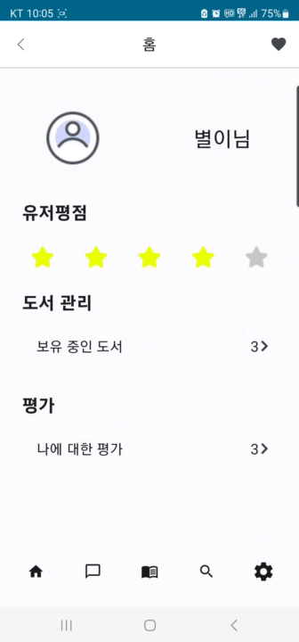
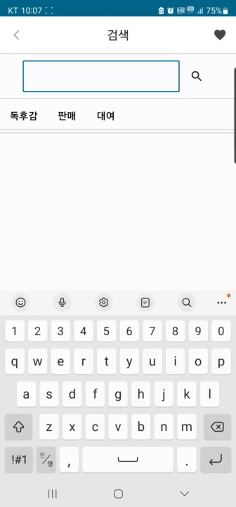
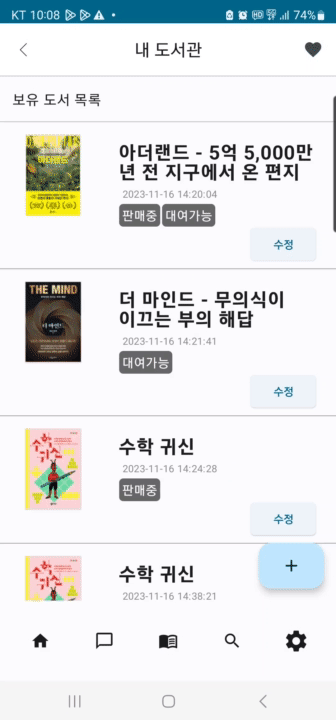
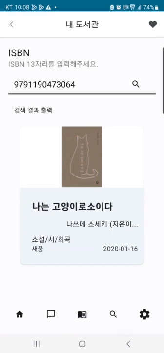
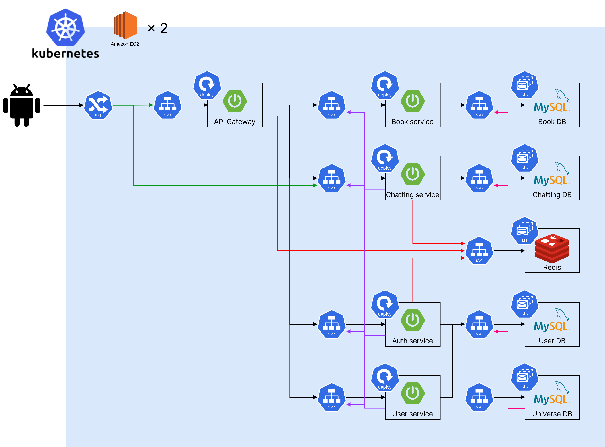
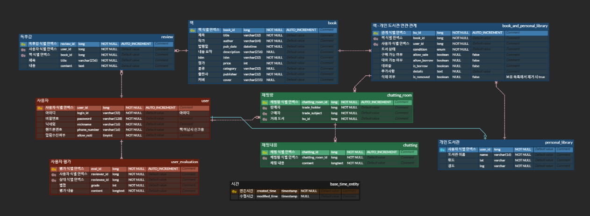

# 북유럽
### 📚[도서 판매 대여를 손쉽게, 개인 도서관 서비스 북유럽](./docs/Ucc홍보영상.mp4)📚

## ⌛️ 프로젝트 진행 기간

### **2023-10-10 ~ 2023-11-17 (39일)**
 

## 👪팀원 소개
멋쟁이 팀원들을 소개할게요. 😊

### 🧑 기대성

- DevOps
- GitHub : [meo-s](https://github.com/meo-s)

### 👦 민정인

- FrontEnd
- GitHub : [chati97](https://github.com/chati97)

### 👨 유승민

- BackEnd
- GitHub : [byuri1356](https://github.com/byuri1356)

### 🧒 이현우

- BackEnd
- GitHub : [dlgusdn978](https://github.com/dlgusdn978)
  

### 🧒 전윤철

- 팀장, BackEnd
- GitHub : [ycjeon0129](https://github.com/ycjeon0129)
  
 

## 📚 프로젝트 소개

### 개인 도서관 운영을 통해
### 책의 접근, 재활용, 공유를 더욱 쉽게 만드는
### 지역 독서문화 장려 앱 애플리케이션 입니다

 

## 🔎 서비스 주요 기능
### 1) 개인 도서관  
- 개인 도서관에 도서를 등록하여 방문자가 어떤 책이 있는지 확인할 수 있음
### 2) 지도 api
- 개인 도서관 위치를 지도 api를 통해 보여줌으로써 가시성 높임
- 도서 거래 위치를 가늠할 수 있음
### 3) 독후감
- 독후감을 통해 여러 사람의 감상을 느낄 수 있음

## 🔎 서비스 주요 기술
### 로딩 페이지

### **SMS API**
- 문자 인증 서비스를 위한 API

### **SPRING STOMP**
- 실시간 채팅을 위한 websocket 기술

### **GOOGLE MAP API**
- 도서관 위치표시를 위한 API
  
### **ALADIN API**
- 도서 정보를 가져오기 위한 API

 

## 서비스 화면

### 📺[시연영상](등록예정)

### 시작화면

 

### 지도

 

### 마이페이지

 

### 도서검색

 

### 도서관

 

### 채팅

 

### 독후감

 

 

## ⚙협업 도구
### JIRA
### GitLAB
### Notion
### MatterMost

 

## 📂 시스템 아키텍처

 

## 📂 ERD

 

## 📔 참조 문서
### [컨벤션](./docs/convention.md)
### [포팅매뉴얼](./exec/porting-manual.md)
